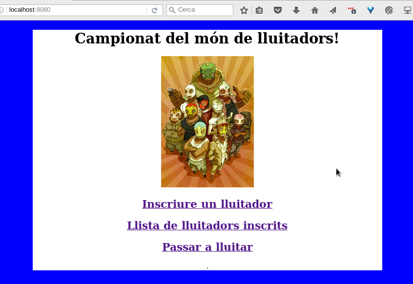

Lluitadors
==============================

Introducció
--------------------
Servidor REST que permet simular un sistema **senzill** de combats. 

No és gaire complexe perquè està pensat per provar les classes `URL` i `HttpURLConnection` de Java

El sistema ofereix mètodes diversos per interactuar amb el Servidor

URL                      | mètode | paràmetres | funció 
-------------------------|--------| ---------- | --------
/Lluitadors/llista       | GET    | -          | Llista tots els lluitadors del campionat
/Lluitadors/llista/nom   | GET    | -          | Llista el lluitador 'nom'
/Lluitadors/llista       | POST   | nom        | Afegeix el lluitador 'nom' al campionat amb una força aleatòria
/Lluitadors/ring/buida   | GET    | -          | Elimina els lluitadors de mostra
/Lluitadors/ring/lluita  | POST   | nom1, nom2 | Fa lluitar dos combatents i dóna el resultat
/Lluitadors/ring/add     | POST   | nom, forca | Afegeix el lluitador 'nom' amb la força 'forca' al campionat
/Lluitadors/ring/resultat| GET    | -          | Mostra el darrer resultat

El sistema també ofereix una part amb HTML per facilitar el funcionament del sistema

 

Execució
---------------
Es tracta d'un programa en Maven i Java, de manera que només cal compilar-lo i executar el `jar` generat:

    $ mvn package
    $ cd target
    $ java -jar Lluitadors-0.0.1-SNAPSHOT.jar

Després es porta el navegador a [http://localhost:8080](http://localhost:8080) i es podrà interactuar amb l'aplicació a través de web.

